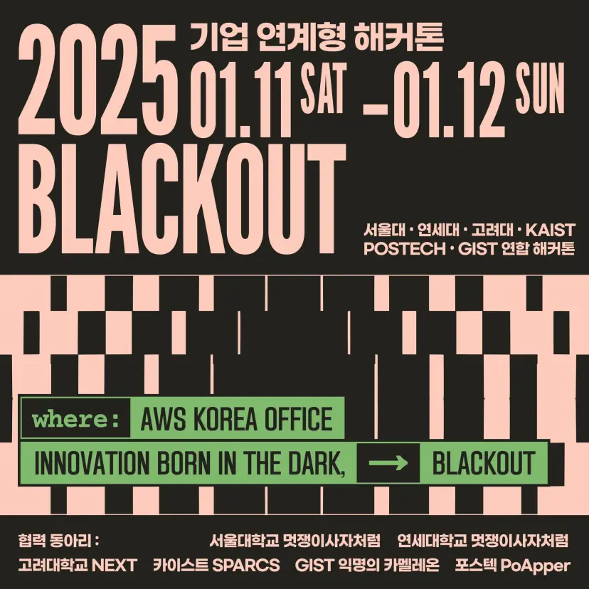
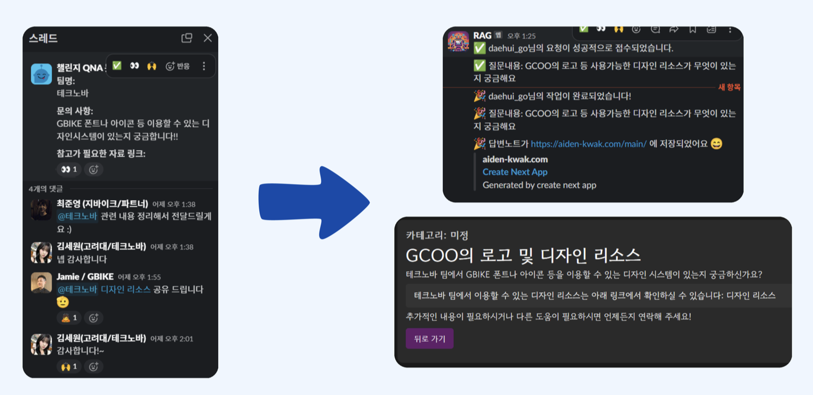

# Slack RAG 기반 정보 검색 및 블로그 생성 서비스

## blackout-hackathon
본 서비스는 2025년 1월 11일부터 2025년 1월 12일 까지 진행된 서,연,고,카,포,지 연합해커톤 기간동안 개발되었습니다.
<p align="center">
	
</p>

## 기술스택
- Django REST Framework
- Next.js
- OPENAI API (gpt-3.5-turbo, text-embedding-3-small)
- Slack
- EC2, Nginx

## 소개
이 서비스는 Slack 채널의 대화 데이터를 활용하여 질문에 대한 과거 대화를 검색하고, 이를 기반으로 적합한 답변을 생성합니다. 또한 생성된 답변은 블로그 형태로 자동 문서화하여 손쉽게 관리할 수 있도록 돕습니다. 반복되는 질문에 대한 부담을 줄이고, Slack의 정보를 체계적으로 정리할 수 있는 새로운 도구를 제공합니다.

## 주요 기능
1. **Slack 채널 데이터 검색**:
   - Slack 채널 내의 과거 대화를 RAG(Retrieval-Augmented Generation) 방식으로 검색합니다.
   - 질문에 대한 원래 메시지, 관련 스레드, 그리고 이를 바탕으로 생성된 답변을 제공합니다.
   - 임베딩은 매번 진행하지 않습니다. 슬랙 커맨드로 트리거되어 임베딩을 진행할때, 한번 임베딩 된 글과 스레드는 체크되어 다시 수행되지 않고, 새로운 글만 기존 임베딩에 새롭게 추가되어 자원낭비를 방지합니다.

2. **임베딩 검색**:
   - Slack 대화 데이터를 효율적으로 검색하기 위해 CDIST 기반의 코사인 거리 검색을 수행합니다. 모든 임베딩을 Numpy 형식으로 변환하고, 쿼리임베딩과 저장된 임베딩간의 거리계산을 통해 상위 k개의 과거 유사 스레드를 추출합니다. 

2. **자동 블로그 생성**:
   - 질문과 추출된 과거 유사 답변들을 기반으로 블로그 형태의 문서를 생성합니다. 생성된 문서는 개인 블로그에 업로드되어 링크가 제공됩니다. 카테고리는 '미정'으로 디폴트세팅되며, 사용자가 자유롭게 다시 카테고라이징할 수 있습니다.
   - 블로그 제목은 질문 내용을 사용하며, Slack 대화를 체계적으로 문서화합니다.
   - 스레드에 참고 링크가 포함되어 있다면 항상 해당 링크는 함께 포함되어 제공됩니다.


## 환경변수 설정
   1. 아래 변수들을 backend/.env에 작성해야합니다.
   ```bash
   DJANGO_SECRET_KEY=key
   DJANGO_GOOGLE_OAUTH2_CLIENT_ID=key
   DJANGO_GOOGLE_OAUTH2_CLIENT_SECRET=key
   DJANGO_GOOGLE_OAUTH2_PROJECT_ID=key
   DEEPSEEK_API_KEY=key # not used in this project
   DEEPSEEK_BASE_URL=https://api.deepseek.com
   OPENAI_API_KEY=key
   SLACK_SECRET_KEY=key
   SLACK_BOT_TOKEN=key
   SLACK_VERIFICATION_TOKEN=key # not used in this project
   ```

   2. Slack 권한 요약
   ```bash
   channels:read, groups:read, im:read, mpim:read (채널 목록 및 메시지 접근)
   channels:history, groups:history, im:history, mpim:history (메시지 기록 읽기)
   chat:write (메시지 전송)
   slack commands 설정(슬래시 명령어 사용)
   ```

## 시연


<p align="center">
	
</p>

## 팀원 및 역할

<table style="width:100%">
  <thead>
    <tr>
      <th style="text-align:center;">성명</th>
      <th style="text-align:center;">담당</th>
      <th style="text-align:center;">깃허브</th>
    </tr>
  </thead>
  <tbody>
    <tr>
      <td style="text-align:center;">곽병혁 (leader)</td>
      <td style="text-align:center;">
      LLM RAG 구현 및 슬랙봇 개발<br/>
      서비스 기획 및 디자인(frontend)<br/>
      </td>
      <td style="text-align:center;"><a href="https://github.com/Aiden-Kwak"></a></td>
    </tr>
    <tr>
      <td style="text-align:center;">김재윤</td>
      <td style="text-align:center;">
        블로그 기능 서버 및 프론트엔드 개발<br/>
        발표자료 디자인
      </td>
      <td style="text-align:center;"><a href="https://github.com/1MTW"></a></td>
    </tr>
    <tr>
      <td style="text-align:center;">고대희</td>
      <td style="text-align:center;">
        인프라(EC2, Nginx)<br/>
        슬랙봇 개발<br/>
        최종 발표
      </td>
      <td style="text-align:center;"><a href="https://github.com/
DaehuiG"></a></td>
    </tr>
  </tbody>
</table>